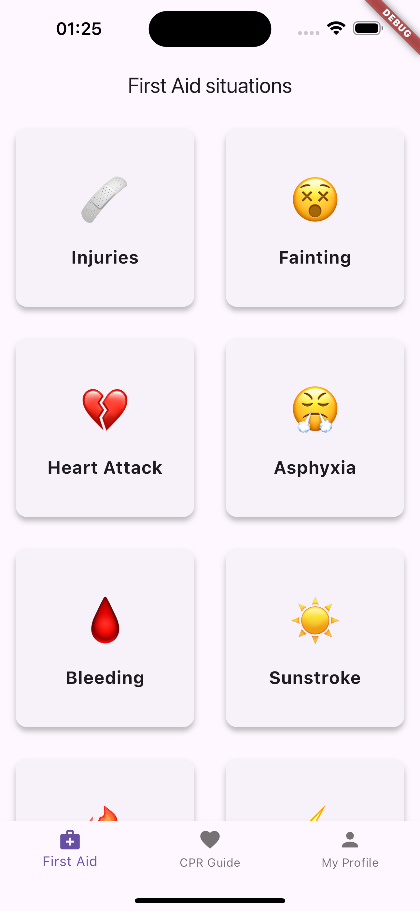
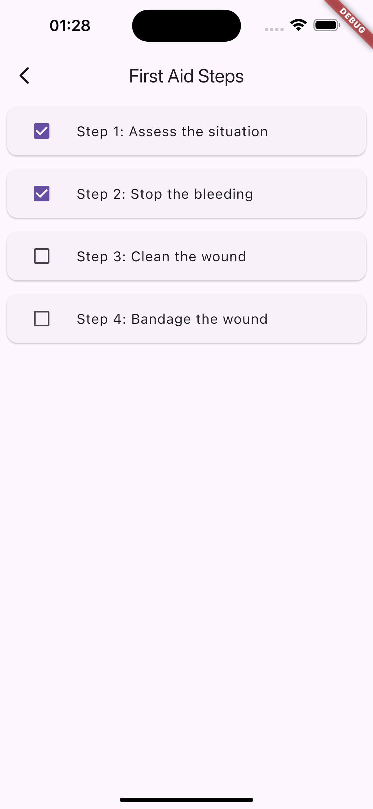
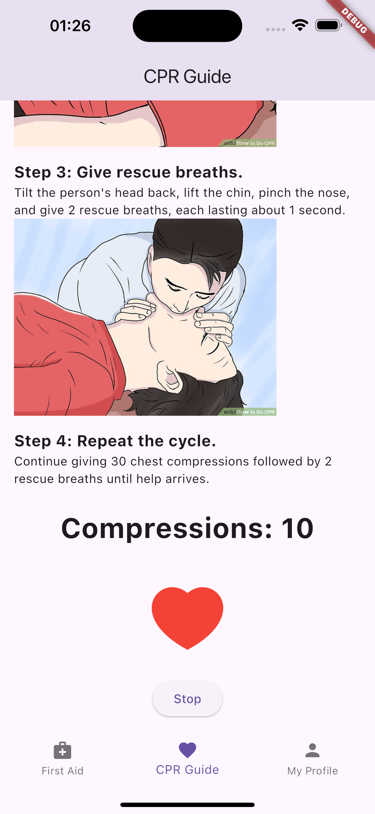
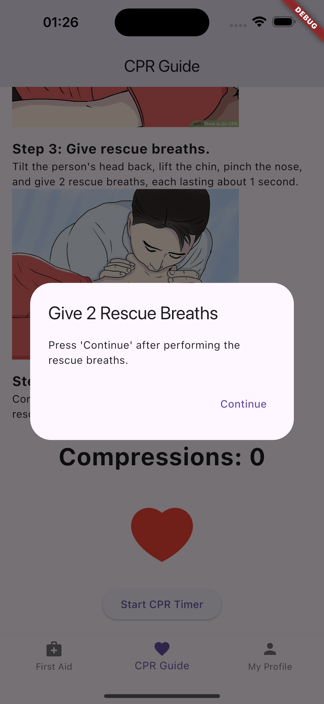
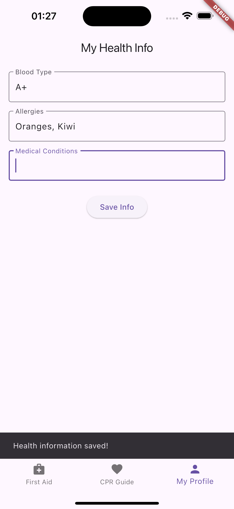

# First Aid Helper App

Cross-platform Flutter application designed to provide users with essential first aid instructions and CPR guidance. This app aims to educate users on how to respond effectively to common medical emergencies, ensuring they can act confidently in critical situations.

## Demo

<p align="center">
  
  
  
  
  
</p>

## Getting started

Follow these instructions to set up the project and run locally.

### Prerequisites

Ensure you have the following installed:

- [Flutter SDK](https://docs.flutter.dev/get-started/install) (Project was developed on 3.24.1 version)
- An IDE like [VS Code](https://code.visualstudio.com/)
- A device or emulator for testing (iOS, Android, or web)

### Installation

1. **Clone the repository using HTTPS:**

   ```bash
   git clone https://github.com/First-Aid-Flutter-App/FirstAid.git
   ```

   **Or SSH:**
   ```bash
   git clone git@github.com:First-Aid-Flutter-App/FirstAid.git
   ```

2. **Install Flutter dependencies:**

    ```bash
    flutter pub get
    ```

3. **Running the App**

    ```bash
    flutter run
    ```

## Features

- [x] Select an injury card and note the steps of first aid

- [x] Familiarize yourself with the CPR instructions and use the timer with counting 

- [x] Fill out a medical card about yourself

## Technical Features

- [x] Using Unit, Widget, Integration, Mocking and Golden test 

- [x] Using GitHub Actions as CI/CD pipeline

- [x] Using Docker for containerizing app

- [x] Localize app to English and Russian languages

- [x] Using [Riverpod](https://pub.dev/packages/riverpod) for state management

- [x] Using CustomPainter for heartbeat animation ❤️

